# Граф зависимостей скиллов

> Сгенерировано `scripts/generate-graph.sh` из `skills.json` — не редактировать вручную.
> Пересборка: `swissknifeman registry`.

Сплошная стрелка `A --> B` — `A` требует `B` (`requires`): `swissknifeman vendor` дотянет `B`
при установке `A`. Пунктирная `A -.-> B` — результат `A` служит входом для `B`
(`produces_for`). Показаны только скиллы, участвующие в графе; изолированные —
в таблице ниже.

```mermaid
flowchart LR
  subgraph architect["architect"]
    agent_design["agent-design"]
    api_design["api-design"]
    architecture["architecture"]
    data_schema["data-schema"]
    eval_design["eval-design"]
    legal_compliance["legal-compliance"]
    observability_design["observability-design"]
    security_design["security-design"]
    tech_stack_selection["tech-stack-selection"]
  end
  subgraph devops["devops"]
    docker_dev_prod["docker-dev-prod"]
    docker_php["docker-php"]
    docker_postgres["docker-postgres"]
    docker_services["docker-services"]
    docker_vite["docker-vite"]
    makefile["makefile"]
  end
  subgraph founder["founder"]
    competitive_analysis["competitive-analysis"]
    idea_discovery["idea-discovery"]
    new_project["new-project"]
    pitch_deck["pitch-deck"]
    risk_assessment["risk-assessment"]
  end
  subgraph frontend["frontend"]
    backend_type_sync["backend-type-sync"]
    wayfinder["wayfinder"]
  end
  subgraph general["general"]
    context_economy["context-economy"]
    git_commit_rules["git-commit-rules"]
    spec_interview["spec-interview"]
    task_brief_template["task-brief-template"]
  end
  subgraph operator["operator"]
    incident_response["incident-response"]
    oncall_rotation["oncall-rotation"]
    postmortem["postmortem"]
    runbook["runbook"]
  end
  subgraph oss_dev["oss-dev"]
    dependency_audit["dependency-audit"]
    dx_design["dx-design"]
    gh_review["gh-review"]
    github_flow["github-flow"]
    oss_development["oss-development"]
    oss_governance["oss-governance"]
    release_engineering["release-engineering"]
  end
  subgraph php["php"]
    botkit["botkit"]
    database["database"]
    filament["filament"]
    laravel["laravel"]
    laravel_security_audit["laravel-security-audit"]
    laravel_structure["laravel-structure"]
    laravel_testing["laravel-testing"]
    modular_architecture["modular-architecture"]
    static_analysis["static-analysis"]
    test_isolation_guard["test-isolation-guard"]
  end
  subgraph pm["pm"]
    brd["brd"]
    business_process["business-process"]
    go_to_market["go-to-market"]
    monetization_design["monetization-design"]
    prd_from_brd["prd-from-brd"]
    product_roadmap["product-roadmap"]
    requirement_critic["requirement-critic"]
    unit_economics["unit-economics"]
  end
  subgraph quality["quality"]
    code_review["code-review"]
    refactoring_plan["refactoring-plan"]
    tech_debt_audit["tech-debt-audit"]
    test_strategy["test-strategy"]
  end
  subgraph system["system"]
    cross_project_coordinator["cross-project-coordinator"]
    local_topology["local-topology"]
    shared_memory["shared-memory"]
  end
  agent_design -->|requires| architecture
  api_design -->|requires| data_schema
  architecture -->|requires| brd
  backend_type_sync -->|requires| wayfinder
  botkit -->|requires| laravel
  brd -->|requires| business_process
  cross_project_coordinator -->|requires| local_topology
  data_schema -->|requires| brd
  database -->|requires| laravel
  dependency_audit -->|requires| oss_development
  docker_services -->|requires| docker_php
  dx_design -->|requires| oss_development
  eval_design -->|requires| agent_design
  filament -->|requires| laravel
  filament -->|requires| laravel_structure
  gh_review -->|requires| context_economy
  github_flow -->|requires| gh_review
  github_flow -->|requires| git_commit_rules
  github_flow -->|requires| release_engineering
  go_to_market -->|requires| competitive_analysis
  laravel_security_audit -->|requires| static_analysis
  legal_compliance -->|requires| architecture
  modular_architecture -->|requires| laravel
  monetization_design -->|requires| idea_discovery
  new_project -->|requires| competitive_analysis
  new_project -->|requires| risk_assessment
  observability_design -->|requires| architecture
  oss_governance -->|requires| oss_development
  pitch_deck -->|requires| competitive_analysis
  pitch_deck -->|requires| go_to_market
  pitch_deck -->|requires| unit_economics
  postmortem -->|requires| incident_response
  prd_from_brd -->|requires| brd
  product_roadmap -->|requires| brd
  refactoring_plan -->|requires| tech_debt_audit
  release_engineering -->|requires| oss_development
  requirement_critic -->|requires| brd
  security_design -->|requires| architecture
  shared_memory -->|requires| local_topology
  tech_stack_selection -->|requires| brd
  test_isolation_guard -->|requires| laravel_testing
  architecture -.->|feeds| api_design
  architecture -.->|feeds| data_schema
  dependency_audit -.->|feeds| security_design
  docker_dev_prod -.->|feeds| docker_services
  docker_php -.->|feeds| docker_dev_prod
  docker_postgres -.->|feeds| docker_dev_prod
  docker_postgres -.->|feeds| docker_services
  docker_vite -.->|feeds| docker_dev_prod
  go_to_market -.->|feeds| product_roadmap
  idea_discovery -.->|feeds| new_project
  laravel_security_audit -.->|feeds| security_design
  legal_compliance -.->|feeds| security_design
  makefile -.->|feeds| docker_dev_prod
  makefile -.->|feeds| docker_services
  monetization_design -.->|feeds| brd
  monetization_design -.->|feeds| go_to_market
  monetization_design -.->|feeds| unit_economics
  oncall_rotation -.->|feeds| incident_response
  prd_from_brd -.->|feeds| api_design
  prd_from_brd -.->|feeds| architecture
  prd_from_brd -.->|feeds| product_roadmap
  runbook -.->|feeds| incident_response
  spec_interview -.->|feeds| task_brief_template
  tech_stack_selection -.->|feeds| architecture
  tech_stack_selection -.->|feeds| oss_development
  tech_stack_selection -.->|feeds| release_engineering
  test_strategy -.->|feeds| code_review
```

**В графе:** 62 скиллов, 41 рёбер requires, 27 рёбер produces_for.

## Изолированные скиллы (74)

Скиллы без связей `requires`/`produces_for` — самодостаточны.

| Бакет | Скиллы |
|---|---|
| blender | `mcp-blender-workflow`, `model-rules`, `threading`, `version-gotchas` |
| devops | `ci-cd`, `db-test-preflight`, `docker`, `gitops`, `node-pnpm-preflight` |
| frontend | `eslint-flat-config`, `inertia-vue`, `js-code-style`, `tailwind-conventions`, `vite-module-loader`, `vite-multi-build`, `vitest`, `vue-composition-api` |
| general | `ai-context-workflow`, `anti-drift`, `compact-responses`, `complex-task-orchestrator`, `cross-layer-change-checklist`, `packages-stack`, `project-map`, `session-handoff`, `skills-ssot`, `ticket-workflow`, `user-roles`, `writing-style` |
| imported | `agent-security-super-skill`, `ai-agent-super-skill`, `content-creative-super-skill`, `dev-engineering-super-skill`, `finance-super-skill`, `legal-super-skill`, `marketing-super-skill`, `operations-cx-super-skill`, `pm-super-skill`, `research-knowledge-super-skill`, `sales-super-skill`, `token-efficient` |
| operator | `capacity-planning` |
| php | `attribute-authorization`, `azguard`, `code-style-spatie`, `dependency-injection`, `enum-attributes`, `laravel-best-practices`, `laravel-broadcasting`, `laravel-dusk`, `laravel-package-compatibility`, `laravel-package-docs`, `laravel-package-expressive`, `laravel-package-generate-skill`, `laravel-package-release`, `laravel-package-scaffold`, `laravel-package-service-provider`, `laravel-package-testing`, `laravel-packages`, `laravel-permissions`, `laravel-subagents`, `medialibrary`, `named-arguments`, `pao`, `pennant-development`, `php-patterns`, `repositories` |
| python | `ml-project-structure`, `venv-dependencies` |
| quality | `code-simplifier` |
| roles | `open-source-maintainer`, `solo-founder`, `startup-cto`, `tech-lead` |
