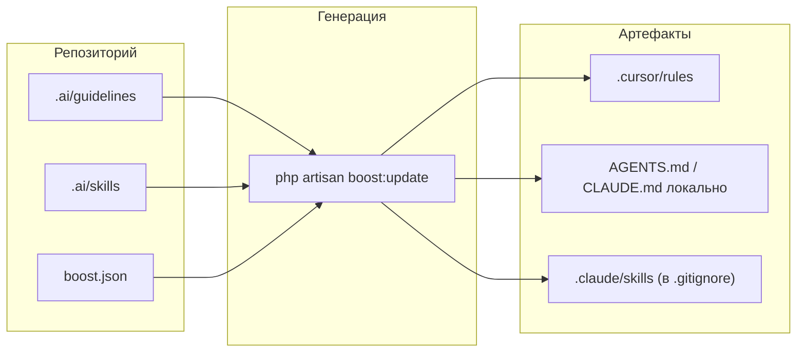

# Устройство репозитория и генерация (SSOT-раскладка)

Источник правды для агентов — каталог **`.ai/`** в корне репозитория и (при использовании Laravel Boost) **`boost.json`**. Раскладка обезличена: `<app>` — имя вашего приложения, доменные скиллы — примеры.

## Единый источник

- **`.ai/guidelines/`** — постоянные правила (архитектура, PHP, формы).
- **`.ai/skills/`** — узкие контексты (домен, инструмент, режим работы).
- **`boost.json`** — список подключаемых skills и агентов (`claude_code`, `cursor`).

### Что генерируется автоматически

После **`php artisan boost:update`** обновляются файлы для агентов:

- `CLAUDE.md`, `AGENTS.md`, `GEMINI.md` (в `.gitignore`)
- `.claude/skills/`
- `.cursor/rules/`

Их **не правят вручную** — правки только в `.ai/` и `boost.json`, затем снова генерация.

## Структура папок

```text
.ai/
  guidelines/
    architecture.md
    ...
  skills/
    <domain>-workflow/SKILL.md
    ...
.agents/
  skills/                # внешние vendor-скиллы
boost.json
skills-lock.json
```

## Поток данных (источник → генерация → потребители)



Агент в IDE опирается на сгенерированные правила и скиллы; править вручную нужно только исходники в `.ai/` и список в `boost.json`.

## Три слоя правил при генерации

`php artisan boost:update` объединяет контекст по приоритету:

1. Boost built-in (`vendor/laravel/boost/.ai/`)
2. Third-party (пакеты из `boost.json`, например Filament, Spatie)
3. Пользовательские **`.ai/guidelines/`** и **`.ai/skills/`**

Проектные правила имеют наивысший приоритет.

## Guidelines vs skills

| Куда | Что |
|------|-----|
| **guidelines** | То, что нужно почти в каждой задаче: слои Actions/Services, именованные аргументы, общие правила тестов. |
| **skills** | Контекст реже половины задач: домен (`<domain>-workflow`), инструмент (`filament-development`), режим (`compact-responses`). |

## Формат файлов

- **Guidelines** — markdown без frontmatter.
- **Skills** — YAML frontmatter с полями `name` и **`description`** с реальными триггерами (классы, сценарии), иначе агент подключает skill неверно.

## Команды

```bash
php artisan boost:install            # установка Boost
php artisan boost:update             # обновление после правок в .ai/
php artisan boost:update --discover  # обнаружение guideline-пакетов
```

Удобно завести алиас проекта вида `composer ai:sync` и вызывать его после `composer update`.

### Внешние skills (skills.sh)

```bash
npx skills find <query>
npx skills add <owner/repo@skill> -y
npx skills check
npx skills update
```

## Добавление нового скилла

1. Создать `.ai/skills/<skill-name>/SKILL.md`.
2. Добавить `<skill-name>` в массив **`skills`** в `boost.json`.
3. Запустить **`php artisan boost:update`** (или `symlink-sync.sh` без Boost).
4. Проверить триггеры в `description`.

Узкие ситуативные правила лучше оформлять как skill, а не guideline.

## Что коммитим

Коммитим: `.ai/guidelines/*.md`, `.ai/skills/*/SKILL.md`, `boost.json`, `skills-lock.json` (если используется), при необходимости внешние `.agents/skills/*`, `.cursorignore`.

Не коммитим сгенерированное (см. `.gitignore`): `CLAUDE.md`, `AGENTS.md`, `GEMINI.md` в корне, `.claude/settings.json`, `.claude/skills/`, `.cursor/skills/`.

Не восстанавливать вручную дубликаты скиллов в `.cursor/skills/`, если команда договорилась о единственном источнике в `.ai/skills/`.

## Операционный цикл команды

1. Изменили `.ai/*`.
2. Выполнили `php artisan boost:update` (или `symlink-sync.sh`).
3. Убедились, что нет дублирования формулировок.
4. Закоммитили исходники (`.ai/*`, `boost.json`, `.cursorignore`).
5. В PR описали цель правила и триггер skill.

## Частые ошибки

- Редактирование `CLAUDE.md` или только `.cursor/rules/*` без правок в `.ai/`.
- Слишком тяжёлые доменные правила в guidelines вместо skill.
- Пустые или абстрактные `description` в `SKILL.md`.
- Несколько «общих» skills с одной ролью; лучше один базовый + один доменный.
- Внешние skills без ревью и без фиксации в `skills-lock.json`.

## Память агента

`.claude/memory/` — персональная память ассистента, не коммитится. Архитектура и стандарты проекта — только в `.ai/`.

## Краткий итог

- Единый источник — **`.ai/`**.
- Обновление — **`php artisan boost:update`** или **`symlink-sync.sh`**.
- Разделение постоянных правил (guidelines) и узких skills.
