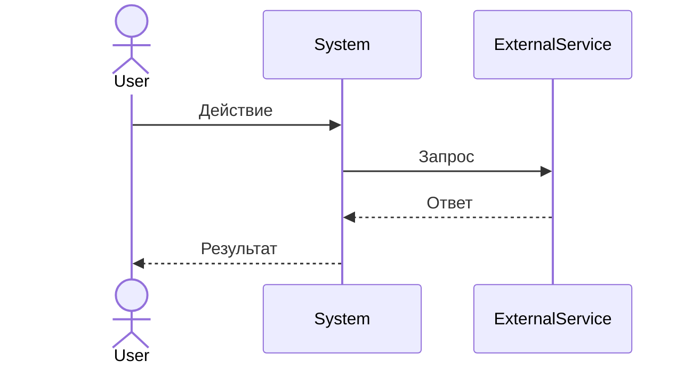
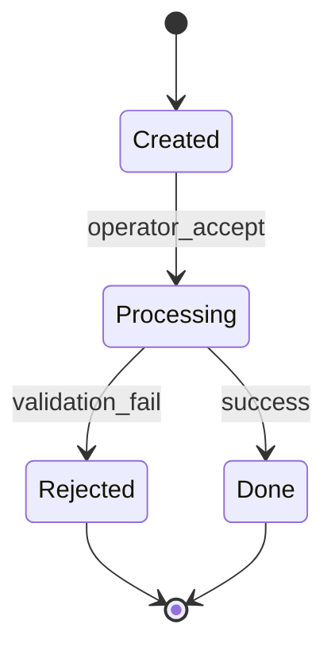

# Skill: Business Process (FSM)

Применять когда: задача на описание бизнес-процесса, workflow, пайплайна.

---

## Принцип: каждый процесс = Finite State Machine

Структура каждого файла в `docs/02_Workflow/`:

```
1. Название процесса
2. Акторы (кто участвует)
3. Триггер (что запускает процесс)
4. Состояния и переходы
5. Обработчики ошибок / rollback
6. Mermaid-диаграмма
```

---

## Формат переходов

```
[Текущее состояние] → [Триггер] → [Новое состояние]
```

Пример:
```
[Заявка создана] → [Оператор принял] → [В обработке]
[В обработке] → [Данные невалидны] → [Отклонена] + уведомление
[В обработке] → [Успех] → [Завершена]
```

---

## Обязательно для каждого состояния

- Что происходит в этом состоянии
- Кто ответственный актор
- Возможные выходы (переходы)
- **Обработчик ошибки**: что делать если что-то пошло не так

---

## Mermaid-диаграмма (обязательна)



Или stateDiagram-v2 для FSM:



---

## Правило одного файла

Один файл = один изолированный процесс. Если процесс зависит от другого — ссылка через `[[Имя процесса]]`, не копирование.

После создания файла — обновить `docs/02_Workflow/_index.md`.
